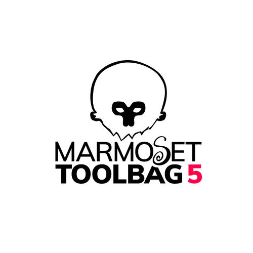
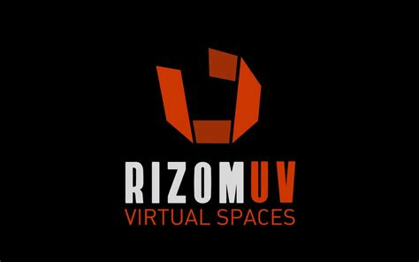
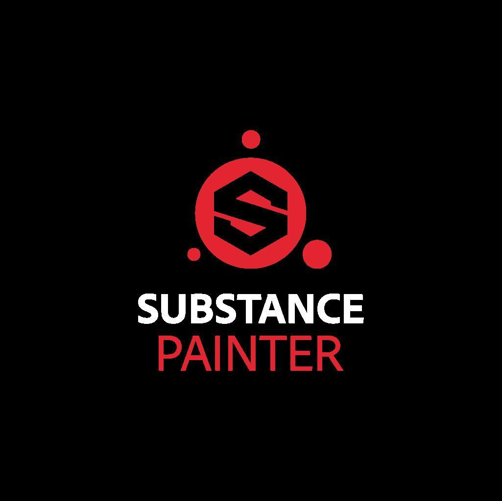
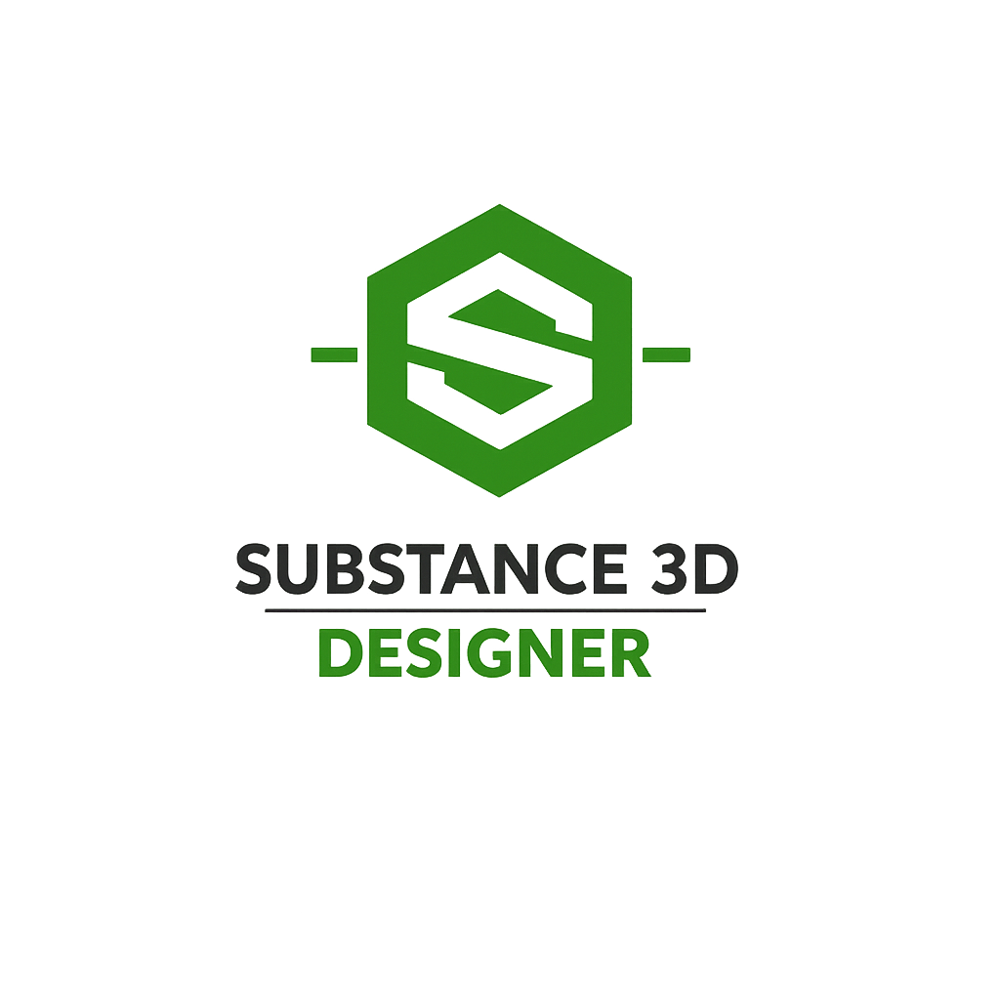
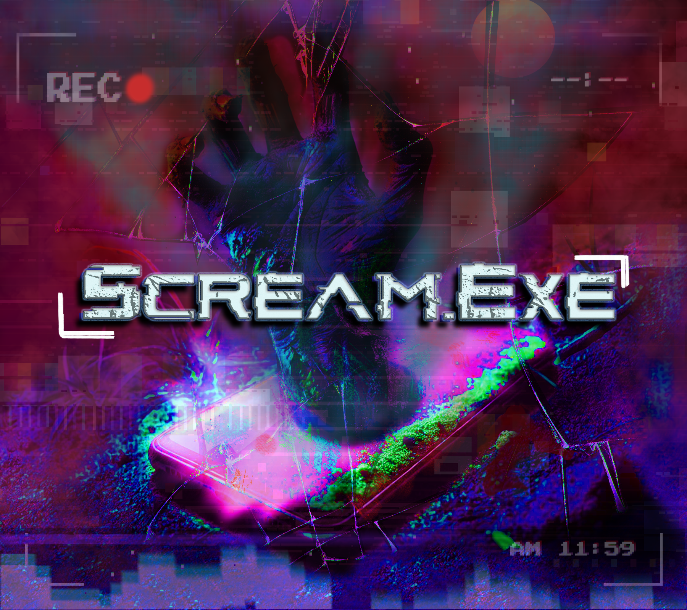

<h1>Hi, I’m Charlize! 👋
</h1>

About Me

🎨 **3D Artist & Modeler** | 💻 **Computer Science Student** | 🎮 **Aspiring Game Developer**

I am a professional 3D Generalist working in 3D art for games and cinematics while studying Computer Science. I combine artistic craft with technical development to create assets, materials, and animations that integrate directly into real-time engines. I am actively learning C++ with Unreal Engine 5 to transition into gameplay and systems development for games.

Core Skills and Tools 🔨
3D and 2D Pipeline

---

## 🛠️ Tools I Use

  
  
  
  
  
  
  
  
  
  
  

## 🎨 My Work 

 

  

