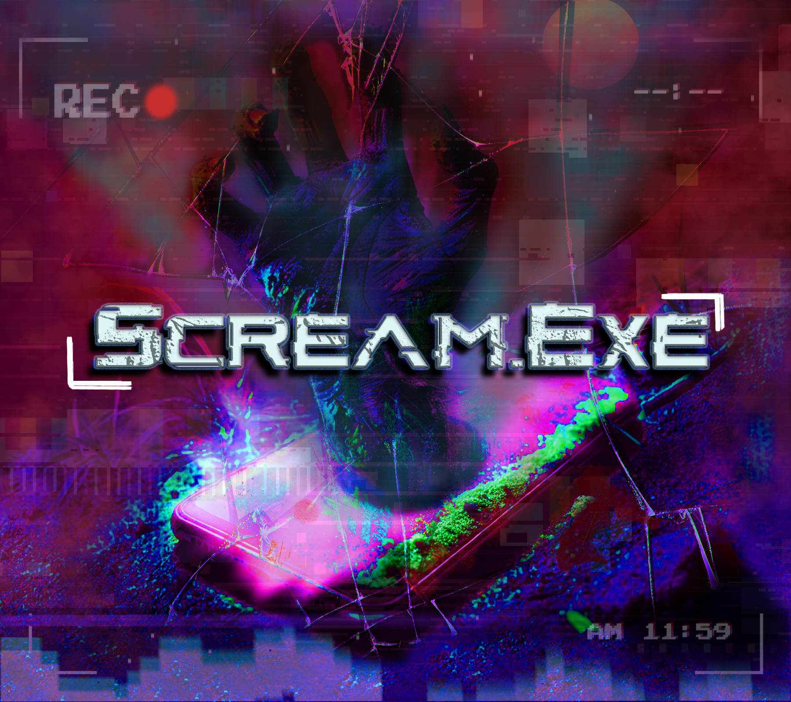

<h1>Hi, I’m Charlize! 👋
</h1>

<h2>About Me</h2>

My name is Charlize Pauli. I'm a Computer Science student at the University of Veiga de Almeida (UVA), and a game developer. 
I'm very passionate about taking on ambitious projects and seeing them through from scratch to the very end. Long-term or short-term projects are ideal.

  
[Open for Work]
 
[Open for Comissions]

-Programming
 
C++, HTML, CSS, Javascript, Python

<h></h>

-Game Dev
 
3D Generalist, Unreal Dev

https://www.artstation.com/charchar96

## Computer Science 

<table align="center">
<tr>
    <td allign="center">
     
    C++
    </td>
    <td allign="center">
     
    HTML
    </td>
        <td allign="center">
     
    CSS
    </td>
        </td>
        <td allign="center">
     
    Javascript
    </td>
            </td>
        <td allign="center">
     
    Python
    </td>

   
<table align="center">
    <td align="center">
       
      [Pending Release]
    </td>
     

  
Indie Game Dev
2+ yearas Experience in Games Industry.

<table align="center">
  <tr>
    <td align="center">
       
      Blender
    </td>
    <td align="center">
       
      Casceduer
    </td>
    <td align="center">
       
      FiberShop
    </td>
    <td align="center">
       
      Affinity Designer
    </td>
  </tr>
  <tr>
    <td align="center">
       
      Clip Studio Paint
    </td>
    <td align="center">
       
      Visual Studio Code
    </td>
    <td align="center">
       
      Marmoset Toolbag 5
    </td>
    <td align="center">
       
      RizomUV
    </td>
  </tr>
  <tr>
    <td align="center">
       
      Substance Painter
    </td>
    <td align="center">
       
      Substance 3D Designer
    </td>
    <td align="center">
       
      Unreal Engine
    </td>
              </td>          
    <td align="center">
       
      Zbrush
    </td>
  <tr>
           </td>
    <td align="center">
       
      Marvelous Designer
    </td>
            </td>
    <td align="center">
       
      Character Creator 5
     </td>
     </td>
     <td align="center">
       
      Sisir
     </td>
             </td>
    <td align="center">
       
      Topogun 3
    </td>
    </tr>
    <tr>
            </td>
    <td align="center">
       
      3DSMax
    </td>
                  </td>
    <td align="center">
       
      Maya
    </td>
                      </td>
    <td align="center">
       
      Photoshop
    </td>

  </td>
    <td align="center">
       
      Metahuman
    </td>
    

  </tr>
</table>

<!-- 
        </td>
    <td align="center">
       
      (Add Caption)
    </td>
    -->
<!--## 🎨 My Work 

 

  
  <!--
  
  
  
  
  
  
  
  
  
  
  
  
  -->

